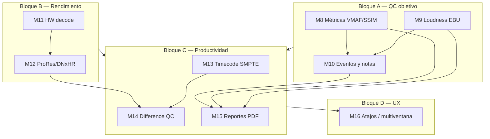

# Roadmap de mejoras DiffPlayerQC v2 — Milestones M8 a M16

**Estado base:** v2.0.0 (M0–M7 completados).  
**Objetivo:** QC objetivo, rendimiento 4K, flujo profesional y UX avanzada.  
**Especificación general:** [`SPEC_V2.md`](SPEC_V2.md) · **Implementación v2.0:** rama `v2/m4-m7-release` / `main`.

---

## Bloque A — Calidad QC objetiva (alta prioridad)

Núcleo del valor “QC objetivo”: métricas, audio profundo y registro de hallazgos.

### M8 — Métricas de video (VMAF / SSIM)

**Estado:** Completado (v2.1) — SSIM, MS-SSIM, MSE, PSNR; VMAF opcional vía FFmpeg `libvmaf`; escaneo 2 Hz; gráfico; heatmap en timeline; navegación entre caídas; export CSV/JSON.

**Objetivo:** Comparación objetiva de calidad entre vídeo A y B.

| | |
|---|---|
| **Entregables** | Crate o módulo `metricas_video.rs`; cálculo en background (FFmpeg/libvmaf o SSIM por frame); serie temporal en UI; export JSON/CSV. |
| **Tareas** | Pipeline de análisis no bloqueante; gráfico PTS → métrica; umbrales y marcado de caídas significativas; integración panel Compare o Report. |
| **Aceptación** | Gráfico visible en UI; cálculo en segundo plano sin congelar reproducción; export funcional. |
| **Rama sugerida** | `m8/metricas-vmaf` |
| **Esfuerzo** | Medio · **Prioridad:** Alta |

**Nota:** Complementa modos visuales AbsDiff/Heatmap (M3); no los sustituye.

### M9 — Análisis de audio profundo (Loudness / DR) ✅

**Objetivo:** QC de audio al nivel broadcast (EBU R128).

| | |
|---|---|
| **Entregables** | [x] `analisis_loudness.rs` (K-weighting Rust); Integrated / True Peak / LRA; silencio y clipping; `forma_onda.rs` + panel Audio + overlay LUFS en waveform. |
| **Tareas** | [x] Escaneo post-apertura (mismo hilo que forma de onda); alertas EBU; doc [`LOUDNESS_M9.md`](LOUDNESS_M9.md). |
| **Aceptación** | [x] Valores tras escaneo; alertas en UI; `lufs_integrado` alineado con EBU (sustituye estimación RMS de M4). |
| **Rama sugerida** | `m9/loudness-ebu` |
| **Esfuerzo** | Medio · **Prioridad:** Alta |

### M10 — Listado de diferencias y notas ✅

**Objetivo:** Registro estructurado de hallazgos QC (manual + automático futuro).

| | |
|---|---|
| **Entregables** | [x] `eventos_qc.rs` en core; JSON en app data; workspace Report + panel Compare; timeline de marcadores. |
| **Tareas** | [x] Filtros manual/vídeo/audio; IPC `listar_eventos`, `crear_evento`, `crear_nota`, `seek_a_evento`; doc [`EVENTOS_M10.md`](EVENTOS_M10.md). |
| **Aceptación** | [x] Lista operativa; persistencia por par A/B; clic → seek. |
| **Rama sugerida** | `m10/eventos-qc` |
| **Esfuerzo** | Alto · **Prioridad:** Alta |

---

## Bloque B — Rendimiento y pipeline (alta prioridad técnica)

Crítico para flujos **4K / ProRes** en hardware real.

### M11 — Pipeline HW Accel (NVENC / VAAPI / VideoToolbox) ✅

**Objetivo:** Decodificación acelerada por GPU.

| | |
|---|---|
| **Entregables** | [x] `decode_hw.rs`; hwdevice por SO; `av_hwframe_transfer_data` + `sws_scale`; fallback software; etiqueta decode en panel Fuentes. |
| **Tareas** | [x] VideoToolbox / VAAPI / D3D11VA+DXVA2; `DIFFPLAYERQC_HW_DECODE=0`; doc [`HW_DECODE_M11.md`](HW_DECODE_M11.md). |
| **Aceptación** | [x] HW cuando FFmpeg/OS lo permiten; reproducción estable con fallback; logs y UI indican ruta activa. |
| **Nota** | Copia CPU→RGBA sigue (optimización GPU directa = hito posterior). |
| **Rama sugerida** | `m11/hw-decode` |
| **Esfuerzo** | Alto · **Prioridad:** Alta · **Riesgo:** Muy alto (drivers / OS) |

### M12 — Formatos profesionales (ProRes / DNxHR)

**Objetivo:** Soporte broadcast / mastering de referencia.

| | |
|---|---|
| **Entregables** | Seek frame-accurate en ProRes/DNxHR; manejo 10/12 bit; metadatos de color (Rec.709 / Rec.2020) en shader y scopes. |
| **Tareas** | Pruebas con fixtures M1 ampliados; corrección de rango legal/full en viewport; documentación de limitaciones por códec. |
| **Aceptación** | Reproducción y color correctos en masters de prueba; sin regresión en h264/mkv. |
| **Rama sugerida** | `m12/prores-dnxhr` |
| **Esfuerzo** | Medio · **Prioridad:** Alta |

**Dependencia:** M11 recomendado antes o en paralelo estrecho con M12.

---

## Bloque C — Productividad QC profesional (prioridad media)

### M13 — Timecode SMPTE y drop frame

**Objetivo:** Navegación y display al estilo broadcast.

| | |
|---|---|
| **Entregables** | Extracción TC desde contenedor; display SMPTE en toolbar; soporte NDF/DF (23.976, 29.97, 59.94); “Ir a timecode”. |
| **Tareas** | Tipos en `crates/core`; conversión PTS ↔ TC; validación con clips de prueba anotados. |
| **Aceptación** | TC en pantalla coincide con metadatos de origen en fixtures conocidos. |
| **Rama sugerida** | `m13/timecode-smpte` |
| **Esfuerzo** | Bajo · **Prioridad:** Media |

### M14 — Sistema A/B con modo “Difference” avanzado

**Objetivo:** Diferencia visual dedicada para QC (más allá del split/diff actual).

| | |
|---|---|
| **Entregables** | Modo Difference en shader (`compare.wgsl`); umbral ajustable; toggle side-by-side / overlay / solo diferencia. |
| **Tareas** | Uniforms de umbral; UI en CompareModePanel; sincronización con offset A/B (ver M13/M10). |
| **Aceptación** | Vista diferencia en tiempo real a 25/30 fps en 1080p software decode. |
| **Rama sugerida** | `m14/difference-qc` |
| **Esfuerzo** | Medio · **Prioridad:** Media |

**Nota:** M3 ya incluye `AbsDiff` y `Heatmap`; M14 unifica UX “Difference” profesional y umbral.

### M15 — Export de reportes y snapshots QC

**Objetivo:** Documentación entregable al cliente / supervisor.

| | |
|---|---|
| **Entregables** | Generación PDF/HTML; capturas A/B/diff por evento; inclusión métricas (M8), loudness (M9), lista eventos (M10). |
| **Tareas** | Plantilla report; comando `exportar_reporte`; snapshots vía pipeline existente o `xcap` en Tauri. |
| **Aceptación** | Reporte de sesión de prueba exportable en &lt; 2 min para proyecto mediano. |
| **Rama sugerida** | `m15/reportes-qc` |
| **Esfuerzo** | Medio · **Prioridad:** Media |

**Dependencia:** M10; recomendable M8/M9 para reportes completos.

---

## Bloque D — UX y mantenibilidad (prioridad baja–media)

### M16 — Atajos personalizables y multi-ventana

**Objetivo:** Flujo rápido y layouts avanzados.

| | |
|---|---|
| **Entregables** | Panel de atajos (JSON persistido); segunda ventana “clean feed” Tauri; opcional docking de paneles (fase 2). |
| **Tareas** | Mapa tecla → acción; conflicto con inputs de texto; API `ventana_secundaria` en `src-tauri`. |
| **Aceptación** | Usuario redefine Space/J/K/L; segunda ventana muestra solo viewport. |
| **Rama sugerida** | `m16/atajos-multiventana` |
| **Esfuerzo** | Medio · **Prioridad:** Baja |

---

## Dependencias entre hitos

---

## Estimaciones (referencia: 1 dev senior full-stack)

| Hito | Duración orientativa | Esfuerzo | Prioridad | Riesgo |
|------|----------------------|----------|-----------|--------|
| M8 VMAF/SSIM | 2 sem | Medio | Alta | Medio (math/shaders) |
| M9 Loudness EBU | 2 sem | Medio | Alta | Medio |
| M10 Eventos/notas | 3 sem | Alto | Alta | Medio (modelo datos) |
| M11 HW Accel | 3 sem | Alto | Alta | **Muy alto** (drivers/OS) |
| M12 ProRes/DNxHR | 2 sem | Medio | Alta | Medio |
| M13 Timecode | 1 sem | Bajo | Media | Bajo |
| M14 Difference QC | 2 sem | Medio | Media | Bajo |
| M15 Reportes | 2 sem | Medio | Media | Bajo |
| M16 UX multiventana | 2 sem | Medio | Baja | Medio |

**Total orientativo:** ~19 semanas (~5 meses) en serie; **paralelizable** Bloque B mientras avanza Bloque A.

### Orden recomendado de implementación

1. **M8 → M9 → M10** — valor QC visible pronto.  
2. **M11 ∥ M8** — rendimiento en paralelo si hay dos personas; si una sola, M11 tras M10 o antes si 4K bloquea demos.  
3. **M12** tras M11.  
4. **M13, M14, M15** en tándem.  
5. **M16** al final o en paralelo con M15.

### Mensaje clave

- **M8 + M9 + M10** = propuesta de valor “QC objetivo” (métricas + audio + trazabilidad).  
- **M11 + M12** = requisito para adopción en flujos **4K / ProRes** reales.

---

## Relación con v2.0.0 ya entregado

| Ya en M0–M7 | Evolución en M8–M16 |
|-------------|---------------------|
| AbsDiff / Heatmap (M3) | M14 Difference dedicado + umbral |
| LUFS estimado (M4) | M9 EBU R128 completo |
| Scopes Inspect (M5) | M8 métricas objetivas complementarias |
| Workspaces Report/Export placeholder | M15 reportes reales |
| Atajos fijos (`shortcuts.ts`) | M16 personalización |

---

## Checklist para abrir un hito

- [ ] Rama `mN/...` desde `main` estable.  
- [ ] Issue con criterios de aceptación copiados de este doc.  
- [ ] Actualizar `SPEC_V2.md` §16 marcando hito en curso.  
- [ ] E2E o test Rust según capa tocada.  
- [ ] Entrada en `CHANGELOG.md` bajo `[Unreleased]` al mergear.
